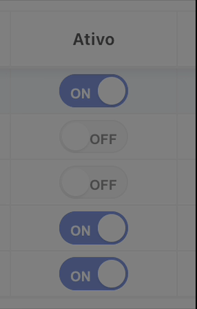

# 📖 Documentação: Plug-in IG Quick Switch (Oracle APEX)

**Objetivo:** Este guia explica como importar e utilizar o plug-in "IG Quick Switch". Este plug-in permite que uma coluna nativa ('S' ou 'N') seja convertida automaticamente num botão Switch clicável e animado.

  

---

## 📥 Etapa 1: Instalação do Plug-in

1. Na tua aplicação APEX, vai a **Shared Components** > **Plug-ins**.
2. Clica em **Import** e faz o upload do ficheiro do plug-in (`dynamic_action_plugin_ig_quick_switch.sql`).
3. Segue os passos do assistente e clica em **Install Plug-in**.

---

## 🚀 Etapa 2: Como Utilizar num Interactive Grid

A implementação na página demora menos de 1 minuto:

### Passo 2.1: Prepara a Interactive Grid
* Region > Type > Interactive Grid.
* Appearance > Template > "Interactive Report".
* Confira se sua Interactive Grid está Edit Enabled e Update Row.

### Passo 2.2: Prepara a Coluna de Dados
Esta é a coluna que vem da tua Interactive Grid (ex: `ATIVO`).
* Seleciona a coluna de dados na árvore de componentes.
* **Type:** Mantém como `Text Field` (É fundamental para o APEX não se sobrepor ao JavaScript do Plug-in).

### Passo 2.3: O Motor do Switch (Dynamic Action)
* Vai à aba **Dynamic Actions** (ícone do raio).
* Clica com o botão direito em **Page Load** > **Create Dynamic Action**.
* Dá-lhe um nome (ex: `Ativar Switches IG`).
* Na ação (TRUE), altera a **Action** para o nosso plug-in: **IG Quick Switch**.
* Em **Settings**, "Colunas Alvo" você irá informar o nome da coluna ou colunas que deseja utilizar o Plug-In. Exemplo: `ATIVO` para uma única coluna ou `ATIVO, ATIVO2` para mais de uma coluna.
* Clica em **Save and Run**. A coluna do teu Interactive Grid transformou-se num Switch com transição elástica!

---

## 👨‍💻 Sobre o Autor & Contatos

Foi desenvolvido e é mantido por **Cleiton Cruz**. Se tens alguma dúvida, elogio, ou sugestão de melhoria, não hesites em contactar:

* ✉️ **Email:** cleiton.rcruz@gmail.com
* 📱 **WhatsApp:** +55 (61) 9 8224-3863
* 🔗 **LinkedIn:** [Conecta-te comigo no LinkedIn](https://www.linkedin.com/in/cleiton-cruz-705373118/)